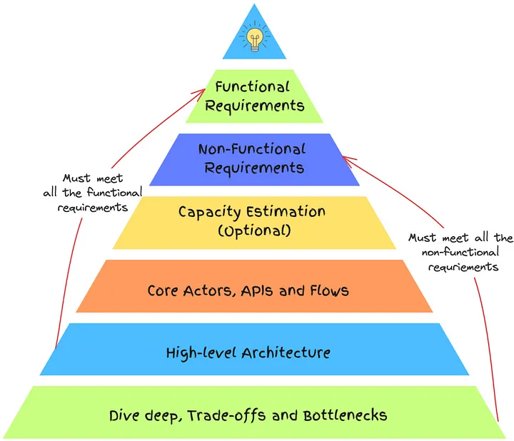

# HLD : What I Wish I Knew Before System Design Interviews

V.V.V Important [https://engineeringatscale.substack.com/p/system-design-interview-success-six-step-framework]

[https://www.systemdesignhandbook.com/system-design-interview-handbook/]

[https://animeshgaitonde.medium.com/what-i-wish-i-knew-before-system-design-interviews-20376f8deafa]

# To summarize, you can better structure your interviews by :-

## Take a top-down approach 
    — Start with requirement gathering and then identify the entities and actors. Then move onto the API design and sketch the flows. 
    - Finally, dive deep into the system, identify bottlenecks and state the design trade-offs.
## Logical connectivity 
    — It helps you navigate the design clearly and also identify the missing pieces if any. For eg:- Your API design helps you with data models, and come up with the right database schema.
## Focus on design completeness 
    — Ensure that the final design meets both functional and non-functional requirements.

## Identify the patterns 
    — Every system is built on a particular pattern. For eg:- All newsfeed systems like X, LinkedIn, Instagram work on the same principle. Instead of reading about every system, understand the high-level pattern and the approach, and then tackle the problem.

# Common Mistakes
- **Poor time management:** Spending too long on one aspect, neglecting others.
- **Lack of prioritization:** Failing to focus on key features (max 2-3) the interviewer wants, given the time constraint.
- **Shallow analysis:** Not diving deep enough to justify choices or discuss alternatives, preventing interviewers from assessing technical depth.
- **Lack of initiative:** Relying too much on interviewer guidance instead of working independently.
- **Overlooking bottlenecks:** Not addressing how the system handles heavy loads or traffic spikes.